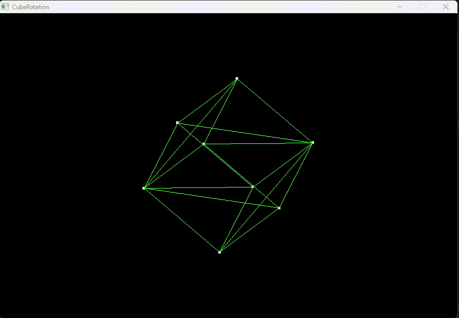

# Cube Rotation

A simple 3D cube rotation visualization project built using **C** and **SDL2**. This project demonstrates 3D transformations, rotations, and rendering onto a 2D surface.

## Features

- Renders a 3D cube onto a 2D screen.
- Simulates rotation of the cube around the X, Y, and Z axes.
- Lightweight, using the SDL2 library for rendering.

## Screenshots

## Dependencies

### Requirements
- **SDL2**: A cross-platform development library designed to provide low-level access to hardware via OpenGL or Direct3D.

## How it Works

The program creates a cube in 3D space and renders it on a 2D screen using a perspective projection. Here’s a breakdown of the functionality:

- **Cube Structure (`struct Cube`)**: 
  - Defined with 8 vertices and 12 triangular faces.
- **Rotation Logic (`rotate_cube`)**: 
  - Applies rotation around the X, Y, and Z axes using trigonometric functions.
- **Rendering (`SDL2`)**:
  - Uses the `SDL2` library to visualize the cube and apply rotations in real time.

### Controls
- `ESC`: Close the application.
